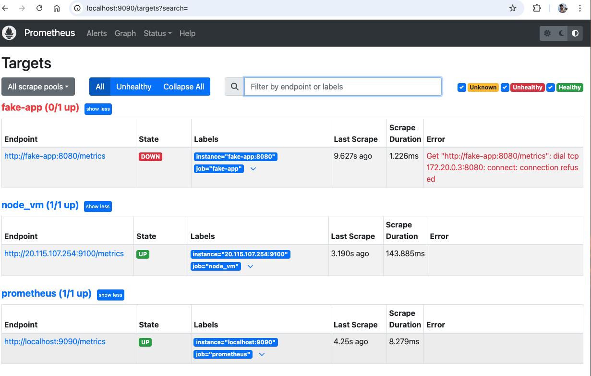
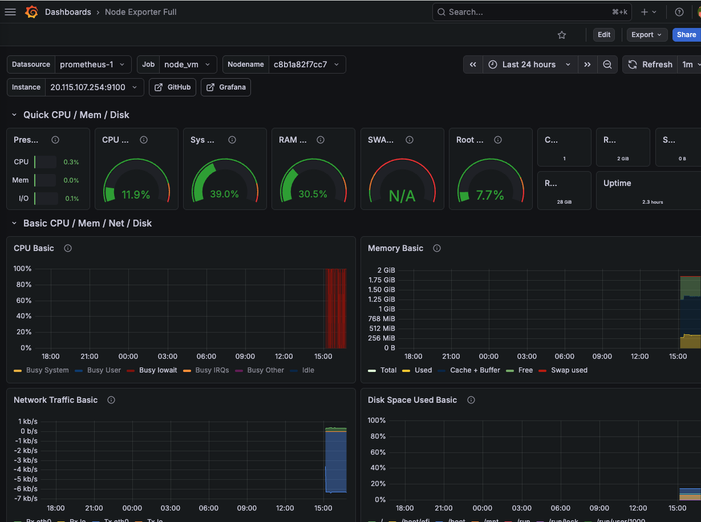
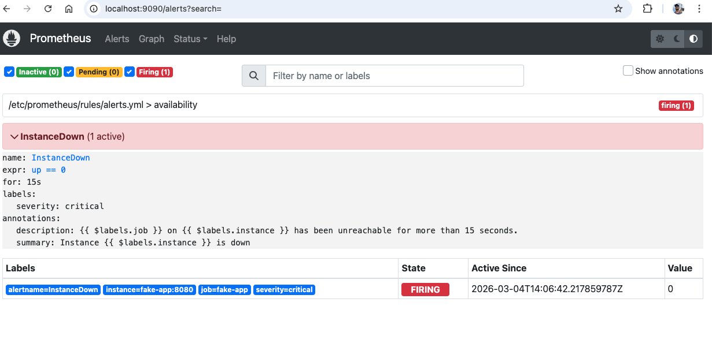

Prometheus & Grafana Monitoring Stack with Alertmanager

Overview

This project demonstrates a basic monitoring stack using Prometheus, Grafana, and Alertmanager running in Docker.

The stack collects system and application metrics, evaluates alert rules, and visualizes metrics through dashboards. Alerts are routed through Alertmanager and sent to a webhook receiver.

This lab helps practice modern DevOps monitoring and observability concepts such as metrics collection, alerting pipelines, and containerized monitoring infrastructure.

**Tech Stack**

Prometheus – Metrics collection and monitoring

Grafana – Metrics visualization dashboards

Alertmanager – Alert routing and notification management

Node Exporter – System metrics exporter

Prometheus – Metrics collection and monitoring

Grafana – Metrics visualization dashboards

Alertmanager – Alert routing and notification management

Node Exporter – System metrics exporter

Docker & Docker Compose – Container orchestration

Webhook Sink – Simulated alert receiver
 d0e4a4c (Add screenshots to README)

Docker & Docker Compose – Container orchestration

 HEAD
Webhook Sink – Simulated alert receiver

**Architecture**

Application / VM
⬇
Node Exporter (metrics)
⬇
Prometheus (scrapes metrics & evaluates alerts)
⬇
Alertmanager (alert routing)
⬇
Webhook Receiver (notification endpoint)
⬇
Grafana (visualization dashboards)

**Project Structure**

Application / VM
⬇
Node Exporter (metrics)
⬇
Prometheus (scrapes metrics & evaluates alerts)
⬇
Alertmanager (alert routing)
⬇
Webhook Receiver (notification endpoint)
⬇
Grafana (visualization dashboards)

Project Structure
 d0e4a4c (Add screenshots to README)
prometheus-lab/
│
├── alertmanager/
│   └── alertmanager.yml
│
├── prometheus/
│   ├── prometheus.yml
│   └── rules/
│       └── alerts.yml
│
├── docker-compose.yml
└── README.md
 HEAD
**How to Run**

How to Run
 d0e4a4c (Add screenshots to README)

Clone the repository and start the monitoring stack:

docker compose up -d

Verify running services:

docker compose ps
**Web Interfaces**

Prometheus UI
http://localhost:9090

Alertmanager UI
http://localhost:9093

Grafana Dashboard
http://localhost:3000

Webhook Sink (alert receiver)
http://localhost:9999

 HEAD
**Learning Goals**

Screenshots
Prometheus Targets

## Screenshots

### Prometheus Targets

### Grafana Dashboard

### Alertmanager UI

Learning Goals
d0e4a4c (Add screenshots to README)

Understand Prometheus architecture

Configure monitoring targets and alert rules

Deploy a containerized monitoring stack

Visualize metrics with Grafana dashboards
 HEAD
Implement alerting workflows using Alertmanager

**Author*

Shishir Pariyar

DevOps / Cloud Engineering Learning Project

